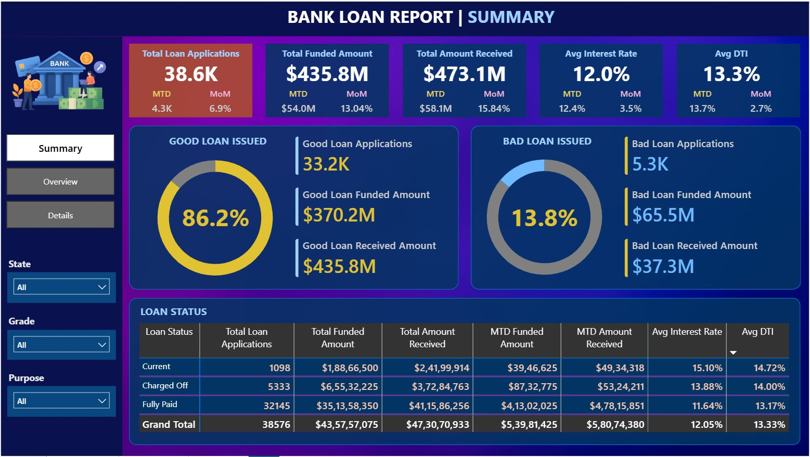
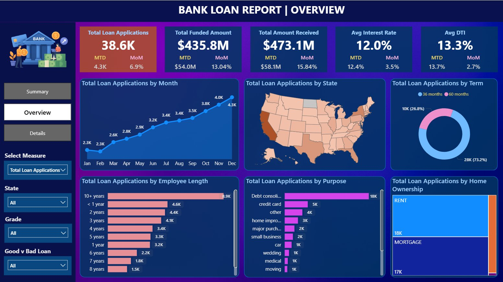
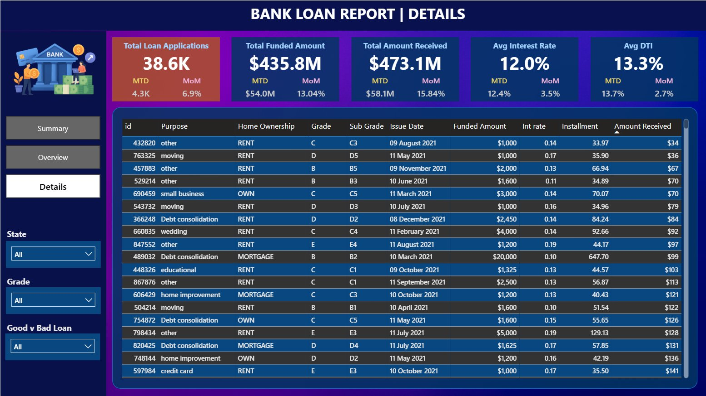

# 🏦 Bank Loan Analysis — Power BI Dashboard

> **End-to-end bank loan portfolio KPI dashboard built in Power BI with DAX measures and calculated columns, fully validated against SQL Server queries for 100% accuracy.**

---

## 📌 Project Overview

This project analyzes a bank's loan portfolio to monitor lending performance, borrower risk, and repayment health across **three interactive dashboard pages** — Summary, Overview, and Details.

### Business Questions Answered
- How many loan applications were received, and how does this compare month-over-month?
- What is the total funded amount vs total amount received back from borrowers?
- What percentage of loans are "Good" vs "Bad"?
- What are average interest rate and Debt-to-Income (DTI) trends over time?
- How does loan performance vary by state, purpose, term, grade, and home ownership?

---

## 📊 Dashboard Preview

| Summary | Overview | Details |
|---------|----------|---------|
|  |  |  |

---

## 🛠️ Tools & Technologies

| Tool | Purpose |
|------|---------|
| **Power BI Desktop** | Dashboard design, DAX calculations, interactive visuals |
| **DAX** | Calculated columns, measures, KPIs (MTD, PMTD, MoM) |
| **SQL Server (SSMS)** | Source data & validation queries |
| **GitHub** | Version control & project documentation |

---

## 📈 Key Metrics (Full Year 2021)

| KPI | Value |
|-----|-------|
| Total Loan Applications | **38,576** |
| Total Funded Amount | **$435.8M** |
| Total Amount Received | **$473.1M** |
| Avg Interest Rate | **12.05%** |
| Avg DTI | **13.3%** |
| Good Loan % | **86.2%** (33,243 loans) |
| Bad Loan % | **13.8%** (5,333 loans) |
| MTD Applications (Dec 2021) | **4,314** — MoM +6.9% |
| MTD Funded (Dec 2021) | **$54.0M** — MoM +13.04% |
| MTD Received (Dec 2021) | **$58.1M** — MoM +15.84% |

---

## 📐 DAX Measures — 23 Total

### Core Totals (5 measures)
`Total Loan Applications` · `Total Funded Amount` · `Total Amount Received` · `Avg Interest Rate` · `Avg DTI`

### MTD — Month-to-Date, December 2021 (5 measures)
`MTD Loan Applications` · `MTD Funded Amount` · `MTD Amount Received` · `MTD Avg Int Rate` · `MTD DTI`

### MoM — Month-over-Month % (5 measures)
`MoM Loan Applications` · `MoM Funded Amount` · `MoM Amount Received` · `MoM Avg Int Rate` · `MoM Avg DTI`

### Good Loan KPIs — `Fully Paid` + `Current` (4 measures)
`Good Loan %` · `Good Loan Applications` · `Good Loan Funded Amount` · `Good Loan Received Amount`

### Bad Loan KPIs — `Charged Off` (4 measures)
`Bad Loan %` · `Bad Loan Applications` · `Bad Loan Funded Amount` · `Bad Loan Received Amount`

👉 Full DAX code: [`dax/measures.md`](dax/measures.md)

---

## ✅ Validation — 100% Match Confirmed

All 23 DAX measures were independently validated using SQL queries in SSMS run directly against the source `dbo.Bank_loan_data` table.

- **31 SQL queries** run across all KPIs and overview visuals
- **MTD:** filtered `WHERE MONTH(issue_date) = 12 AND YEAR(issue_date) = 2021`
- **PMTD:** filtered `WHERE MONTH(issue_date) = 11 AND YEAR(issue_date) = 2021`
- **MoM %** cross-verified manually: `(MTD − PMTD) / PMTD`

| Section | Queries | Result |
|---------|---------|--------|
| Core KPIs (Total, MTD, PMTD) | 15 | ✅ All match |
| Good Loan KPIs | 4 | ✅ All match |
| Bad Loan KPIs | 4 | ✅ All match |
| Overview Visuals (State, Term, Purpose, etc.) | 8 | ✅ All match |

👉 Full validation report: [`docs/validation_report.md`](docs/validation_report.md)  
👉 SQL queries: [`sql/validation_queries.sql`](sql/validation_queries.sql)  
👉 Results CSV: [`sql/results/kpi_validation_results.csv`](sql/results/kpi_validation_results.csv)

---

## 📁 Repository Structure

```
📁 bank-loan-powerbi/
│
├── 📄 README.md                             ← Project overview (this file)
├── 📊 Bank_Loan_Project.pbix                ← Power BI project file
├── 📄 financial_loan.csv                    ← Source dataset (38,576 records)
│
├── 📁 dax/
│   ├── measures.md                          ← All 23 DAX measures with code
│   └── calculated_columns.md               ← Calculated column definitions
│
├── 📁 sql/
│   ├── validation_queries.sql               ← 31 SQL validation queries
│   └── results/
│       └── kpi_validation_results.csv       ← DAX vs SQL comparison (all ✅)
│
├── 📁 screenshots/
│   ├── summary_page.png
│   ├── overview_page.png
│   └── details_page.png
│
└── 📁 docs/
    └── validation_report.md                 ← Full DAX vs SQL validation report
```

---

## 🚀 How to Use

1. Clone or download this repository
2. Open `Bank_Loan_Project.pbix` in **Power BI Desktop**
3. Update the data source connection to point to your SQL Server instance (or load from `financial_loan.csv` directly)
4. Refresh the data model
5. Explore the three dashboard pages: **Summary → Overview → Details**

---

## 📬 Contact

Connect with me on [LinkedIn](https://www.linkedin.com/in/vishal-choudhary-finance-analytics) or raise a GitHub Issue for any questions!
